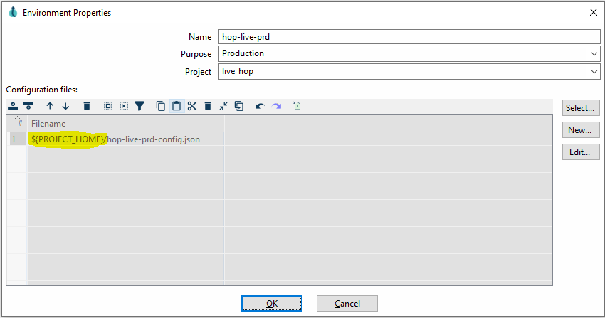
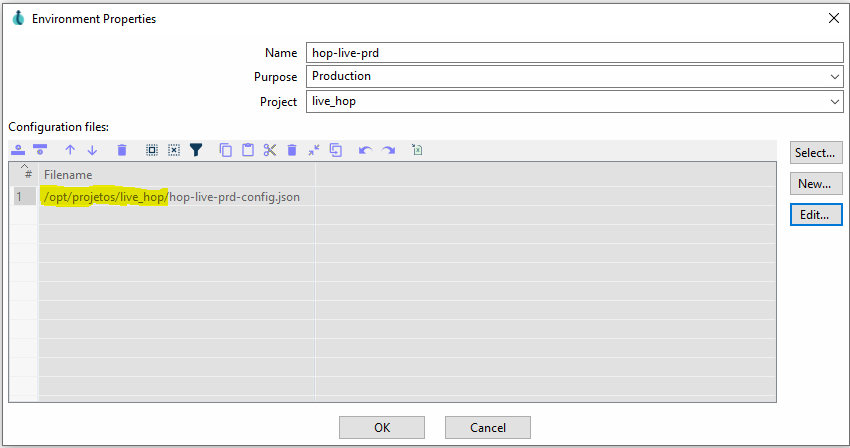
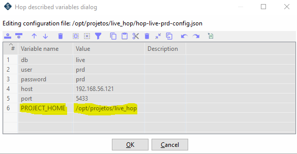

# Instalação do Apache Hop para Desenvolvimento Local

<br>

## Configurando pastas

<h3> Antes de iniciar, precisamos definir alguns Padrões de Pastas para que posteriormente facilite a configuração do servidor de execuções </h3> 

<br>

<h3> <b> Windows </b> -> Crie a seguinte estrutura de diretórios:

* C:\
	* opt
		* projetos 
			* hop_jdbc
			* hop_config
			* projeto_hop_empresa_a
			* projeto_hop_empresa_b
			* projeto_hop_empresa_c
			* projetos_airflow
			* docker_airflow
			* docker_hop

<h3> <b> Linux </b> -> Crie a seguinte estrutura de diretórios:

A pasta opt, existe por padrão no linux

* /
	* opt
		* projetos 
			* hop_jdbc
			* hop_config
			* projeto_hop_empresa_a
			* projeto_hop_empresa_b
			* projeto_hop_empresa_c
			* projetos_airflow
			* docker_airflow
			* docker_hop

Para criar a pasta projetos, é necessário usar o comando abaixo

```bash
sudo mkdir /opt/projetos
```

Não somente isso, é necessário alterar as permissões da pasta para que seu usuário possa criar outras pastas e arquivos nela. Use o comando abaixo para isso

```bash
sudo chown -R $USER:$USER projetos/
```

## Repositórios Básicos

* [Projeto Hop](https://github.com/pauloricardoferreira/live_hop)
	* git clone https://github.com/pauloricardoferreira/live_hop.git
	
* [Configuração Hop](https://github.com/pauloricardoferreira/live_hop_config)
	* git clone https://github.com/pauloricardoferreira/live_hop_config.git

<br>	
As pastas abaixo da pasta projetos, é criada conforme necessidade.

<br>
<h2><b>Descrições das pastas</b></h2>

<p> <b> hop_jdbc </b> -> aqui vai estar os de bancos de dados utilizados pelo Apache Hop, como Oracle, MySQL, Firebird entre outros que por questões de licença, não são adicionadas ao Apache Hop

<p> <b> hop_config </b> -> aqui vai estar a configuração central do Apache Hop. Com esta pasta separada, é possivel fazer updates de versões do Hop sem a necessidade de copiar para outro lugar. Fica tudo centralizado

<p> As demais pastas são criadas conforme necessário


<br>

# Iniciando a instação

Passos Necessário
 - Instalar o Java
 - Baixar o Apache Hop
 - Configurar Variáveis de ambiente
 - Executa o Apache Hop

<br>

**1 - Instalar o Java**

- Para quem está no **Windows**, acesse: https://www.java.com/pt-BR/, faça o download e instale.
- Para quem está no **Linux**, use o gerenciador de pacotes de sua distribuição e instale o pacote openjdk-{versao}-jre.
- O Apache hop necessita do Java na versão 8 ou superior, recomendo a versão 11.

<br>

**2 - Faça o Download mais recente do Apache Hop : https://hop.apache.org/download/**

<br>

**3 - O Apache Hop possui algumas configurações através de variáveis de ambientes do sistema:**

- HOP_CONFIG_FOLDER -> caminho padrão para o arquivo de configuração central do apache hop
	>ex: C:\opt\projetos\hop_config
- HOP_OPTIONS -> Variável com opções da JVM
	>ex: -Xmx5120m -Dfile.encoding=UTF8 
	Define o tamanho de memória máximo a ser utilizado e o encoding para UFT8
- HOP_JAVA_HOME / JAVA_HOME / PENTAHO_JAVA_HOME -> caminho da localização do java, caso tenha mais de uma versão instalada
	>ex: C:\Program Files\Java\jdk-11.0.15
- HOP_SHARED_JDBC_FOLDER -> caminho para drivers externos
	>ex: C:\opt\projetos\hop_jdbc

<br>

**4 - Antes de continuar**

- Se você estiver em computador com Windows, crie uma pasta no C:\ chamada opt.
- Se você estiver em um computador com Linux, essa pasta já existe em /opt

>A dica acima é para padronizar a instalação, pois o Apache HOP converte C:\ que é a raiz do sistema Windows para / que é a raiz do sistema Linux.

<br>

**5 - Instalando o Apache Hop**

- Descompacte o arquivo zip do apache na pasta opt de seu sistema.
- Para o o linux é necessário alterar o dono da pasta para que funcione corretaente com o comando abxio.

	>sudo chown -r {nome_de_usuario} /opt/hop

- Após execute o arquivo contido na pasta /opt/hop/hop-gui.sh para Linux ou /opt/hop/hop-gui.bat para Windows

<br>

**Dicas Extras**

- O Apache Hop já vem com alguns Drivers OpenSouce para deternminados bancos de Dados, porém caso seja necessário baixe o Driver .jar no site do proprietário e adicione em:
	- **Windows**
	<br>
	`C:\opt\hop\plugins\databases\{nome_do_banco}\lib` 
	- **Linux**
	<br> 
	`/opt/hop/plugins/databases/{nome_do_banco}/lib`

	<br>

- Artigo de como definir variáveis de ambiente no Linux: https://www.cyberciti.biz/faq/set-environment-variable-linu
- Artigo de como definir variáveis de ambiente no Windows: https://www.supertutoriais.com.br/pc/como-criar-variaveis-personalizadas-windows-10/


<br>

### Dica de Configuração para Apache Hop

<br>

A dica abaixo, é para quem utiliza o plugin da damaviz.

Atualmente há uma limitação no pluguins, e essa configuração se faz necessário.

Eu fiz um fork do projeto, e essa limitação não existe.

**Algumas coisas estão em Desenvolvimento, então acompanhe os repositórios.**

Se você já criou seu projeto, para usar o Hop juntamente com Airflow o o Plugin [airflow-hop-plugin](https://github.com/damavis/airflow-hop-plugin) desenvolvido pela Damaviz, é necessário fazer algumas alterações nas configurações das variáveis.


* A imagem abaixo, é como o Hop configura por padrão
**`${PROJECT_HOME}/nome_do_arquivo.json`**




* A imagem abaixo é como deve ficar sua configuração onde **`/opt/projetos/hop_live/`** é o caminho do seu projeto. 



* Também é necessário criar uma variável neste arquivo, conforme imagem abaixo. Desta forma garantimos que tudo irá funcionar perfeitamente.



<br>

Você deve estar se perguntando o porque dessas configurações.
O Apache Hop e o Plugin que já comentei, foi projetado para trablhar com apenas um projeto.
Então essas configurações garantem que podemos trabalhar com diversos projetos, pois o pluguin faz leituras de arquivos de configurações e envia tudo isso para o Hop Server.
